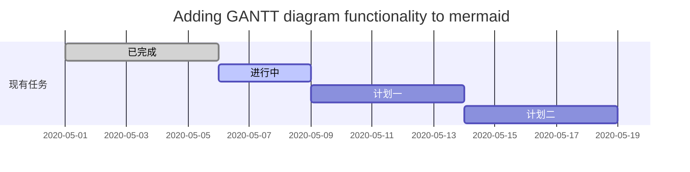
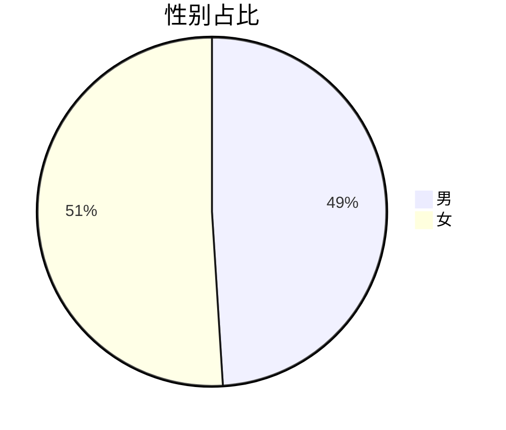

# 一级标题

## 二级标题

#### **四级标题加粗**

*斜体*

<u>下划线内容</u>

~~要删除的内容~~

- 第一条内容
- 第二条内容
  1. 有序表第一条内容

<www.baidu.com>

| 姓名 | 性别 | 年龄 |
| ---- | ---- | ---- |
| 敬轩 | 男   | 29   |


[toc]


:happy:

:cry:

~~~java
public Class User {
  
}
~~~


```j

```


>你要引用的内容


$$
Y=Ax+b
$$


我在行左 $Y=Ax+b$ 我在行右

\sin(x)

\in


---

***

$$
G(x)=\frac{1}{\sqrt{2\pi}\sigma}e^{-\frac{x^2}{2\sigma^2}}
$$

$$
\color{red}{变色}\color{green}{变色}\color{blue}{变色}
$$






展示一下分割线

***


> 注意：以上内容均为测试使用


1. 第一个要点
2. 第二个要点
   * 此要点
   * 此要点


三件事情需要做：

- [ ] 第一件事

* [ ] 第二件事

* [x] 第三件事


```flow
st=>start: 用户登陆
op=>operation: 登陆操作
cond=>condition: 登陆成功 Yes or No?
e=>end: 进入后台

st->op->cond
cond(yes)->e
cond(no)->op
```


```sequence
对象A->对象B: 对象B你好吗?（请求）

Note right of 对象B: 对象B的描述

Note left of 对象A: 对象A的描述(提示)

对象B-->对象A: 我很好(响应)

对象A->对象B: 你真的好吗？
```


```sequence
Title: 标题：复杂使用

对象A->对象B: 对象B你好吗?（请求）

Note right of 对象B: 对象B的描述

Note left of 对象A: 对象A的描述(提示)

对象B-->对象A: 我很好(响应)

对象B->小三: 你好吗

小三-->>对象A: 对象B找我了

对象A->对象B: 你真的好吗？

Note over 小三,对象B: 我们是朋友

participant C

Note right of C: 没人陪我玩
```


$$
\begin{array}{|rrrrrrrr|}
\hline
\verb+#000+ & \color{#000}{text} & \verb+#005+ & \color{#005}{text} & \verb+#00A+ & \color{#00A}{text} & \verb+#00F+ & \color{#00F}{text}  \\
\verb+#500+ & \color{#500}{text} & \verb+#505+ & \color{#505}{text} & \verb+#50A+ & \color{#50A}{text} & \verb+#50F+ & \color{#50F}{text}  \\
\verb+#A00+ & \color{#A00}{text} & \verb+#A05+ & \color{#A05}{text} & \verb+#A0A+ & \color{#A0A}{text} & \verb+#A0F+ & \color{#A0F}{text}  \\
\verb+#F00+ & \color{#F00}{text} & \verb+#F05+ & \color{#F05}{text} & \verb+#F0A+ & \color{#F0A}{text} & \verb+#F0F+ & \color{#F0F}{text}  \\
\hline
\verb+#080+ & \color{#080}{text} & \verb+#085+ & \color{#085}{text} & \verb+#08A+ & \color{#08A}{text} & \verb+#08F+ & \color{#08F}{text}  \\
\verb+#580+ & \color{#580}{text} & \verb+#585+ & \color{#585}{text} & \verb+#58A+ & \color{#58A}{text} & \verb+#58F+ & \color{#58F}{text}  \\
\verb+#A80+ & \color{#A80}{text} & \verb+#A85+ & \color{#A85}{text} & \verb+#A8A+ & \color{#A8A}{text} & \verb+#A8F+ & \color{#A8F}{text}  \\
\verb+#F80+ & \color{#F80}{text} & \verb+#F85+ & \color{#F85}{text} & \verb+#F8A+ & \color{#F8A}{text} & \verb+#F8F+ & \color{#F8F}{text}  \\
\hline
\verb+#0F0+ & \color{#0F0}{text} & \verb+#0F5+ & \color{#0F5}{text} & \verb+#0FA+ & \color{#0FA}{text} & \verb+#0FF+ & \color{#0FF}{text}  \\
\verb+#5F0+ & \color{#5F0}{text} & \verb+#5F5+ & \color{#5F5}{text} & \verb+#5FA+ & \color{#5FA}{text} & \verb+#5FF+ & \color{#5FF}{text}  \\
\verb+#AF0+ & \color{#AF0}{text} & \verb+#AF5+ & \color{#AF5}{text} & \verb+#AFA+ & \color{#AFA}{text} & \verb+#AFF+ & \color{#AFF}{text}  \\
\verb+#FF0+ & \color{#FF0}{text} & \verb+#FF5+ & \color{#FF5}{text} & \verb+#FFA+ & \color{#FFA}{text} & \verb+#FFF+ & \color{#FFF}{text}  \\
\hline
\end{array}
$$


